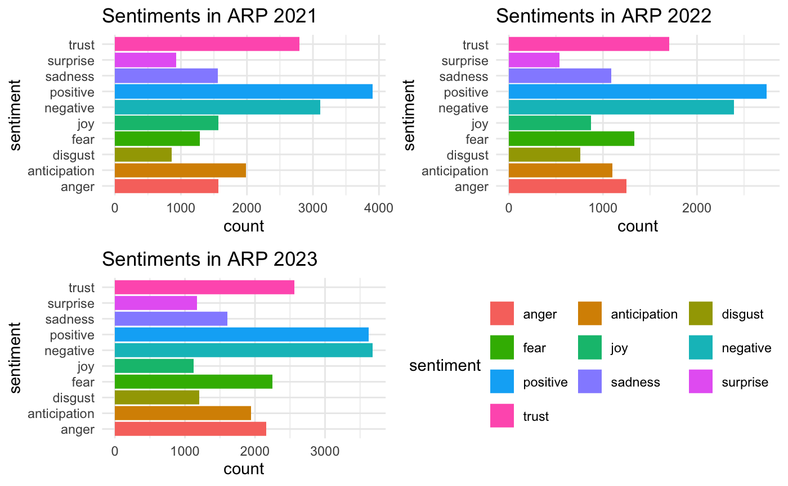
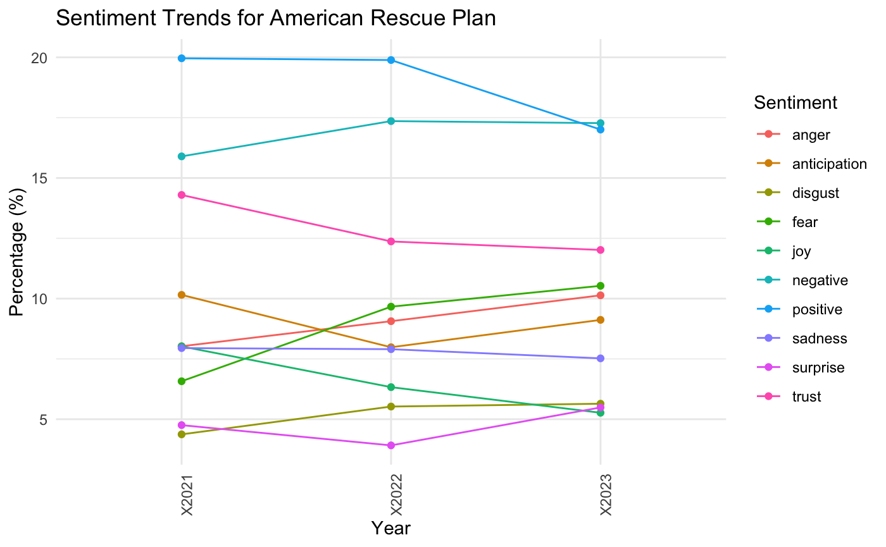
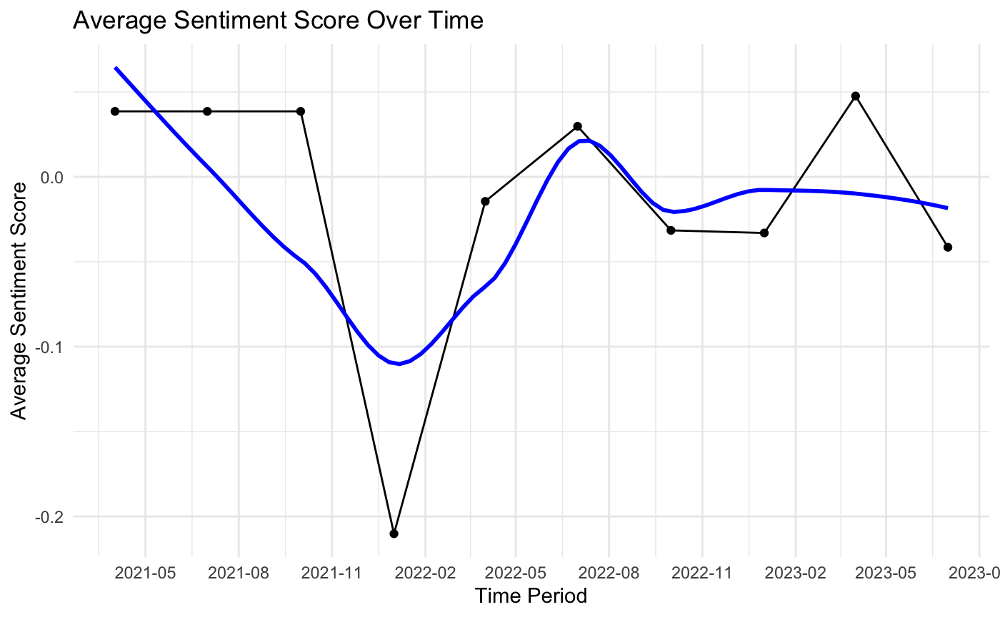
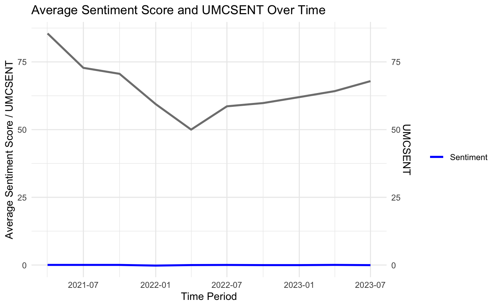
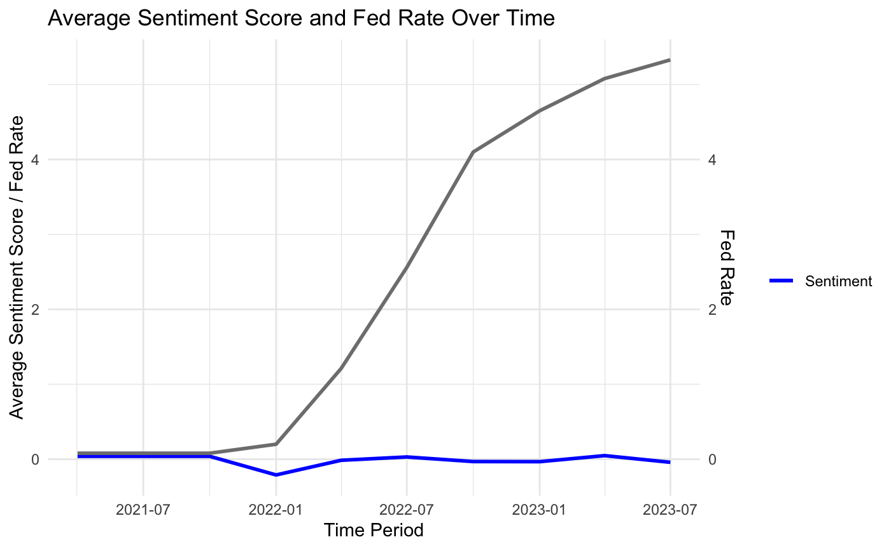

```{r setup, include=FALSE}
knitr::opts_chunk$set(echo = TRUE)
```

## Sentiment Analysis of Comments on Reddit Posts About the American Rescue Plan

Github Repo: <https://github.com/d67373upup/727_final_project>

### Introduction

\
The American Rescue Plan, enacted in March 2021, is a crucial part of the United States' response to the COVID-19 pandemic. This \$1.9 trillion package has generated a lot of discussion, making it a perfect topic for sentiment analysis. In this project, we will analyze public sentiment about the American Rescue Plan using comments from Reddit posts. We will focus on how these sentiments have changed from 2021 to 2023, providing insights into how the public views the Plan.

Reddit is a popular platform where people express a wide range of opinions. By analyzing comments on the "politics" subreddit, we can gain valuable insights into how the public perceives and reacts to the American Rescue Plan over time. Our goal is to track how these sentiments have evolved, giving us a better understanding of how the public's opinions about this significant government action have shifted.

### Methodology

\
Our methodology encompasses several stages, from data extraction to sentiment analysis and visualization:

**Data Extraction and Data Cleaning**

For our data extraction, we used two different time intervals: one based on years and the other based on quarters. This approach allowed us to capture a comprehensive view of discussions related to the American Rescue Plan on the 'politics' subreddit and capture both broad trends over time and more nuanced shifts within shorter periods.

Yearly Interval Extraction: We first gathered URLs of Reddit posts discussing the American Rescue Plan from the 'politics' subreddit, spanning from 2021 to 2023. This was done using the RedditExtractoR package, which helped us efficiently filter and collect relevant posts. For each year, we extracted comments using the get_thread_content function. We then processed these comments by breaking them down into individual words (unnest_tokens), and removing common stop words (anti_join) that do not contribute to sentiment analysis. This step was crucial to ensure that our analysis focused on meaningful content.

Quarterly Interval Extraction: To delve deeper, we also segmented our data on a quarterly basis. Here, we focused on the most popular posts in each quarter, recognizing that not all quarters had substantial discussions about the American Rescue Plan. This was evident as some quarters had only a single relevant post. Our analysis on a quarterly basis ranged from March 11, 2021, to September 30, 2023.

The posts were categorized based on their posting dates, helping us to analyze sentiments separately for each year and quarter. For the quarterly data, we only collect the most popular post. However, we noticed that in the most recent quarter of 2023, there were no significant posts related to the American Rescue Plan, leading us to exclude this quarter from our analysis.

**Sentiment Analysis**

We employed two distinct sentiment analysis methods: the NRC Emotion Lexicon for our yearly data and the Syuzhet method for our quarterly data. Each method served a specific purpose in our analysis, enabling us to capture both the variety and the overall tone of sentiments expressed in the comments.

Yearly Sentiment Analysis: We then applied the NRC Emotion Lexicon to our preprocessed data. The NRC lexicon categorizes words into different emotions and sentiments.

Quarterly Sentiment Analysis: Syuzhet method allows us to assess the overall sentiment of each comment, giving us a general sense of the public's sentiment over time. We calculated the average sentiment score for each quarterly comment (average_sentiment_2021_2, average_sentiment_2021_3, etc.) using our function get_average_sentiment. This function applies the Syuzhet sentiment scoring to each comment and then calculates the mean of these scores. The mean score represents the overall sentiment for that quarter.

**Data Visualization Description**

For the yearly analysis of sentiments towards the American Rescue Plan, we created two types of graphs: sentiment distribution graphs and comparative sentiment trends. Sentiment distribution graphs depict the distribution of various sentiments for each year (2021, 2022, and 2023). Comparative sentiment trends is a line graph that illustrates the change in sentiment percentages over the three years.

For the quarterly analysis, we created three sets of graphs: Sentiment Score Graph, Sentiment and Michigan Consumer Sentiment Index comparison, and Sentiment and Federal Funds Effective Rate Comparison. Sentiment Score Graph present the average sentiment scores for each quarter. The second graph combines the sentiment analysis with the Michigan Consumer Sentiment Index. The last graph shows the relationship between public sentiment and the Federal Funds Effective Rate. The comparison graphs offer insights into how economic perceptions might correlate with feelings about the American Rescue Plan.

### Analysis

\
**Yearly data**

In combined_plot and cobined_plot_1, we examine the charts and the provided information, it becomes evident that public sentiment regarding the American Rescue Plan has been undergoing a notable shift on an annual basis. Specifically, there has been an increase in unfavorable emotions such as anger, disgust, and fear, while positive emotions like hope, happiness, and trust have been experiencing a decline.



In the year 2021, a majority of the reactions were characterized as positive, accounting for 57.19% of the total, with negative sentiments comprising 42.81%. However, in 2022, a noteworthy transformation began to take place, as positive sentiments decreased to slightly over half, representing 50.49%, while negative sentiments gradually rose to 49.51%. As we transitioned into 2023, this trend persisted, with negative sentiments surpassing positive ones at 51.10%, while positive sentiments trailed behind at 48.90%.



**Quarterly data**

The graph_q1 presents the average sentiment score over time. There's a marked downward trend towards the end of 2021, specifically in December, where a significant dip in sentiment is observed. This could be due to a variety of factors, such as the emergence of new COVID-19 variants, or potential economic downturns. The fluctuations in sentiment throughout the periods may reflect the public's reaction to ongoing  policy implementations or other economic factors. Therefore, we will delve into it with other economics indexes.

{width="550"}

The graph_q2 illustrates the average sentiment score alongside the Michigan Consumer Sentiment Index (UMCSENT) over time. This visualization indicates that while sentiment scores remained relatively low, the UMCSENT experienced a significant dip and recovery through the observed period. The noticeable decline in UMCSENT in mid-2022 suggests a period of lowered consumer confidence, which could be attributed to various macroeconomic factors like inflation. Notably, the sentiment score does not mirror the UMCSENT's recovery, indicating that while consumer confidence may have rebounded. Therefore, the sentiment towards the American Rescue Plan did not correspond with UMCSENT.

{width="550"}

In the graph_q3, we observe the relationship between the average sentiment score regarding the American Rescue Plan and the Federal Funds Effective Rate. The graph demonstrates a noticeable increase in the Federal Funds Rate, signaling the Federal Reserve's efforts to tighten monetary policy in response to inflationary pressures. This policy shift appears to follow the sentiment's significant dip in December 2021, suggesting a responsive measure by the Federal Reserve to the inflation concerns that may have contributed to negative public sentiment. The rise in the Federal Funds Rate after December 2021 coincides with a rebound in sentiment, which could be interpreted as public approval of the Federal Reserve's acknowledgment and action against inflation. However, the rebound in sentiment is not sustained, and after March 2022, sentiment trends downward again. This subsequent decline might reflect public concern over the effects of a tightening monetary policy, such as higher interest rates, which can often lead to reduced consumer spending and a slowdown in economic growth. It indicates that while the initial response to combat inflation may have been met with optimism, the reality of a stricter monetary environment could have dampened public sentiment over time.

{width="550"}

### Conclusion

\
Looking at the feelings people have about the American Rescue Plan, we see that opinions have changed over time. The Average Sentiment Score Over Time Chart shows that people weren't feeling too positive about the plan in 2021, but things got better and then they started to swing up and down again after 2021. This might mean that people were unsure or didn't like the plan at first, maybe because they were worried about what it would do, but then they started to feel better about it before their opinions began to jump around again.

In conclusion, the way people feel about the American Rescue Plan has been complicated. Their opinions haven't moved in the same way as the bigger economic mood or with things like changes in interest rates. This might be because the plan started when the economy was trying to bounce back from the COVID-19 pandemic. It also could be that people's feelings about the plan are being shaped by things that are specific to the plan itself or by the political situation, not just by the overall economy. To further understand the mechanisms that affect people's sentiment towards the American Rescue Plan, we looked at what newspapers have been saying. They point out a few reasons: Economic situation would affect how people view this plan. Political disagreements are making feelings about the Plan more divided. And the way the media reports on these issues can change how people feel.

All these parts are mixed together, making it pretty hard to figure out how people really feel about the American Rescue Plan. It's not just a simple thing -- a lot of different stuff comes into play. Things like how the economy is doing, what politicians are saying, and how the news talks about it all have a role. Every one of these parts adds something to the big conversation and shows why we need to be careful and thoughtful when we try to understand or guess what people think about big government actions.\

### Limitations

\
1. Data Scope Limitation. Our analysis has some limitations due to the data source we used, which comes exclusively from one subreddit. Moreover, we only looked at the most popular posts in the quarterly data, which might not represent a wide range of opinions.  Additionally, Reddit users might tend to have similar viewpoints because of the platform's user base. To address these limitations and get a more diverse set of perspectives, it would be helpful to include data from other subreddits. Additionally, to get a more complete picture of public sentiment across various social media platforms, we recommend adding data from other sources like platform 'X'.

2\. Due to the disparate scale of the y-axes, visual comparison of sentiment analysis with economic indices in the quarterly data plots faced challenges. This discrepancy emerged as a consequence of attempting to integrate two distinct metrics within a single graphical framework, which did not deliver the anticipated level of clarity.  In future analyses, it would be better if we use different ways to show the data that can make the scale differences between the datasets easier to understand.
